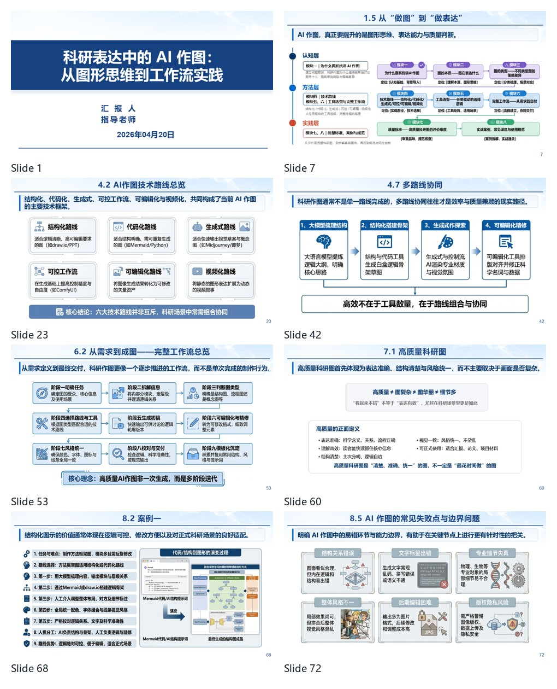

# 科研表达中的 AI 作图

从图形思维到工作流实践。

这套材料最初整理自一次课题组内部分享。它不把 AI 作图理解为“输入一句提示词，直接得到一张图”，而是从科研表达任务出发，讨论图的本质、图示类型、技术路线、工具选型、完整工作流，以及正式科研场景中的质量与风险控制。

## 在线预览

## 内容结构

1. 科研中的 AI 作图
2. 图的本质
3. 科研图的主要类型
4. AI 作图的六条技术路线
5. 任务驱动的工具选型
6. 从需求到成图的完整工作流
7. 科研图质量评价框架
8. 案例、能力边界与使用规范

## 核心观点

- 科研图的最高准则是清楚，而不是花哨。
- 图类型先于工具选择，表达目标决定图类型。
- AI 作图不只有生成式路线，还包括结构化、代码化、可控工作流、可编辑化与视频化。
- 高质量科研图通常由多条路线协同完成。
- AI 适合辅助结构梳理、视觉探索和初稿生成，最终逻辑、准确性与质量仍需研究者负责。

## 文件

| 文件 | 说明 |
| --- | --- |
| `slides/AI科研作图-公开版.pdf` | 推荐在线阅读与快速预览 |
| `slides/AI科研作图-公开版.pptx` | 可编辑的轻量公开版 |
| `xiaohongshu/post.md` | 小红书首帖文案 |
| `xiaohongshu/carousel-script.md` | 9 页小红书图文脚本 |
| `PUBLICATION_CHECKLIST.md` | 发布前版权、隐私与准确性检查 |

公开版已移除演示稿中的个人姓名、导师信息、校徽、批注、个人文档元数据和内嵌视频。视频相关页面保留内容框架与静态示意。

## 一套可复用的科研作图工作流

## 如何使用

- 第一次接触 AI 科研作图：建议从 PDF 顺序阅读。
- 正在制作一张图：先看图类型、工具选型和工作流部分。
- 正在准备正式材料：重点查看质量评价、失败点和风险控制部分。
- 团队内部培训：可以直接基于 PPTX 修改，但建议保留原始出处。

## 关于工具名称

材料记录了制作时使用或讨论过的工具。AI 产品更新很快，具体名称、版本、价格与能力可能变化。比记住工具名单更重要的是理解任务、路线和交付要求之间的匹配关系。

## 许可与引用

本仓库中的原创文字、结构和公开版演示文稿拟采用 `CC BY-NC-SA 4.0` 许可分享。演示稿中引用的第三方论文图、产品界面、影视画面、图标和案例素材，其权利归原作者或相应权利人所有，仅用于教学、评论与方法说明。

使用或二次修改前，请自行确认使用场景是否满足相关版权、隐私、数据安全及平台规范。若发现归属标注或公开边界问题，欢迎提交 Issue。

## 作者

- GitHub: [nanfengy](https://github.com/nanfengy)
